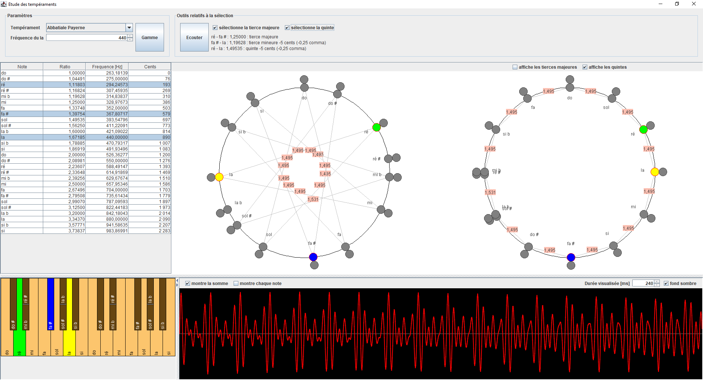

# Etude des tempéraments musicaux

Cette application propose quelques outils pour visualiser / étudier / écouter les tempéraments musicaux :
- tempérament égal
- tempérament pythagoricien
- tempérament mésotonique 1/4 de comma
- tempérament particulier de l'orgue de l'église Abbatiale de Payerne
- tempéraments de Werckmeister

